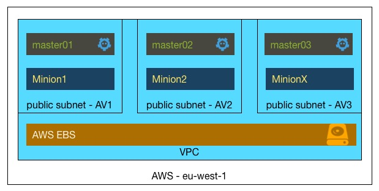

Mini clusters will create one VPC, three Networks, three masters and three worker nodes. The etcd cluster will run on the master nodes, and is HA.

Requirements

 1. aws or cs api/secret keys. These are defined in main.tf
 2. A discovery token, which can be obtained by visiting https://discovery.etcd.io/new?size=3
