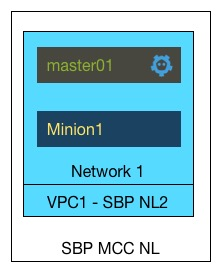

### tf-cs-kubernetes
Nano k8s stack:
- 1 VPC
- 1 Network
- 1 Master
- 1 worker


 

Will auto provision and build in CloudStack. Use the variables.tf file to adjust settings to suit your environment. Will auto generate self signed certificates and use for communication.

### Known issues

 1. If not running in the Schuberg Philis cloud, you will not be able to access our internal registry.
 2. Certificate is self-signed, so you will need to add `insecure-skip-tls-verify` to be true in your kubectl config (instructions below)

### Pre-Requisites
 1. Create your API key and Secret key in ~/.terraform/api_key and ~/.terraform/secret_key
 2. Edit main.tf to point to these files, and adjust your URL to point to your CloudStack API server
 3. Edit variables.tf to suit your environment
 4. Have kubectl installed: `wget https://storage.googleapis.com/kubernetes-release/release/v1.3.0/bin/darwin/amd64/kubectl`

### Usage
 1. Clone this repo
 2. Type `terraform apply`
 3. Choose a cluster name, for example, `sbpt` or `andy`
 4. Your cluster should build, and should output something similar to:

```
 Apply complete! Resources: 13 added, 0 changed, 0 destroyed.

The state of your infrastructure has been saved to the path
below. This state is required to modify and destroy your
infrastructure, so keep it safe. To inspect the complete state
use the `terraform show` command.

State path: terraform.tfstate

Outputs:

  addresses = Master IP addresses are 85.222.238.96 and worker IP addresses are 85.222.238.231
```
 
- Configure your kubectl to talk to the cluster using the following commands, replacing the IP address with the output shown above:

- `kubectl config set-cluster my-cluster --server=https://$IPADDRESS:6443 --insecure-skip-tls-verify=true`
- `kubectl config set-credentials my-user --token=changeme`
- `kubectl config set-context my-context --cluster=my-cluster --user=my-user`
- `kubectl config use-context my-context`

 
- You should now be able to use your Kubernetes cluster:

 `kubectl get cs`

```
NAME                 STATUS    MESSAGE              ERROR
controller-manager   Healthy   ok
scheduler            Healthy   ok
etcd-0               Healthy   {"health": "true"}
```

 `kubectl get nodes`

```
NAME          STATUS    AGE
10.100.0.18   Ready     4m
```

### Deploying DNS

- `kubectl create -f addons/skydns-rc.yaml`
- `kubectl create -f addons/skydns-svc.yaml`

### Deploying the dashboard

- `kubectl create -f addons/dashboard.yaml`

You can now view it by going to the worker IP (at the end of terraform output) on port `32400`

### Deploying monitoring

- Get the ip address of the master using `terraform show | grep cloudstack_instance.kube-master -A 5`
- Edit monitoring/prometheus-configmap.yaml and edit the etcd targets to be this IP.
- Run `kubectl create -f monitoring/`
- You can now view it by going to the worker IP (at the end of terraform output) on port `32900`

### Running a toolbox to test things inside the cluster

- `kubectl run -i --tty busybox --image=busybox --generator="run-pod/v1"`


### Cleaning up
 `terraform destroy`
